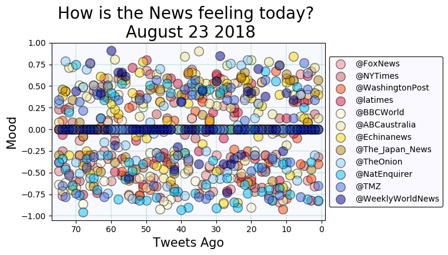
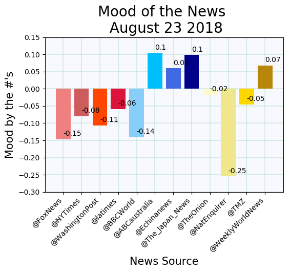
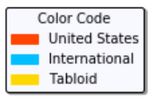
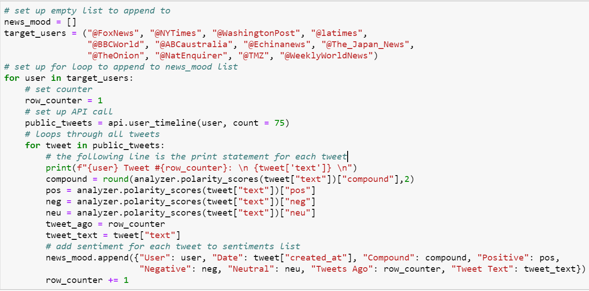
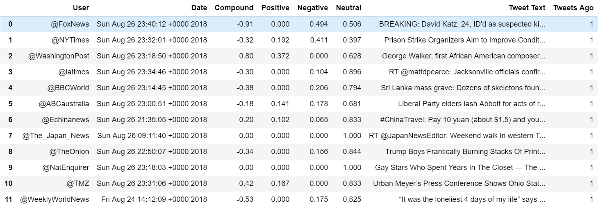
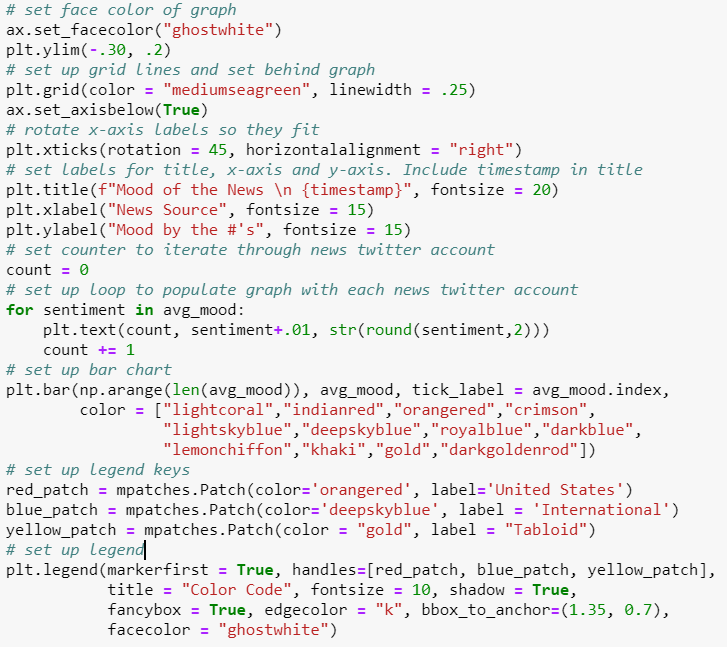
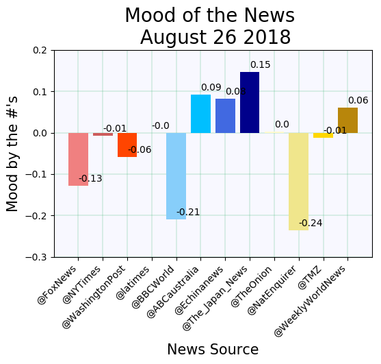

# What is the Mood of the News today?
  
### Task:
For this project I chose to run a sentiment analysis on 12 news related Twitter accounts in order to check the mood of the news. Twleve news sites were split into 3 catagories and 75 tweets from each were pulled for a total of 900 data points. I chose 4 US news sites, 4 international sites, and 4 tabloids (just for fun).

|United States|International|Tabloid|
|-------------|-------------|-------|
|@FoxNews|@BBCWorld|@TheOnion|
|@NYTimes|@ABCaustralia|@NatEnquirer|
|@WashingtonPost|@Echinanews|@TMZ|
|@latimes|@The_Japan_News|@WeeklyWorldNews|   

### Process
Using a variety of Python dependencies I was able to seek out current tweets using API's. Then, VADER analysis was used to check the mood of the posts. Eventhough Positive, Negative, and Neutral feeling were analyzed, I chose to use the Compound results for my graphs and analysis. I created and saved a CSV of the results and set up a DataFrame to view those results here in Jupyter Notebook. To visualize the many data points I set up a scatter plot with the 75 most recent tweets from each news outlet mapped to the x-axis and the compound score from the VADER analysis mapped on the y-axis. The compound score can be a -1 at the most negative, and a +1 for the absolute most positive tweet. Also, a bar graph was set up to view the mean score for each news outlet (the scatter plot can be a lot to take in {900 points after all} so the bar graph may easier to visually digest).

* _snippet of for loop code and snippet of DataFrame_

 

### Analysis:
The two days that I checked the mood showed US news trending negative, international trending positive, and the tabloids trending mostly neutral except for @NatEnquirer which was very negative on both days (I guess men pregnant with bat babies gets a low score). To get a more in depth (and meaningful) result from this excersise I could check the Mood of the News over a week, or month.

* _code snippet of bar graph and snippet of second bar graph_

  
